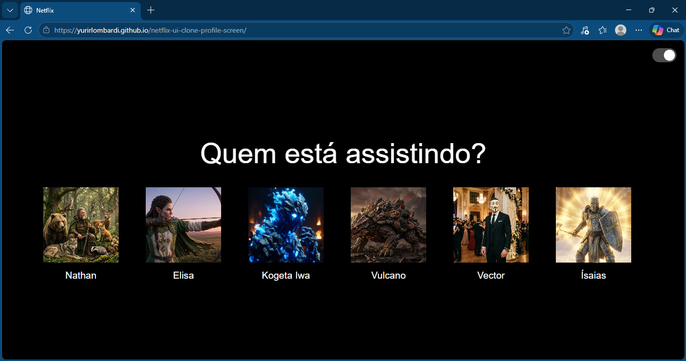
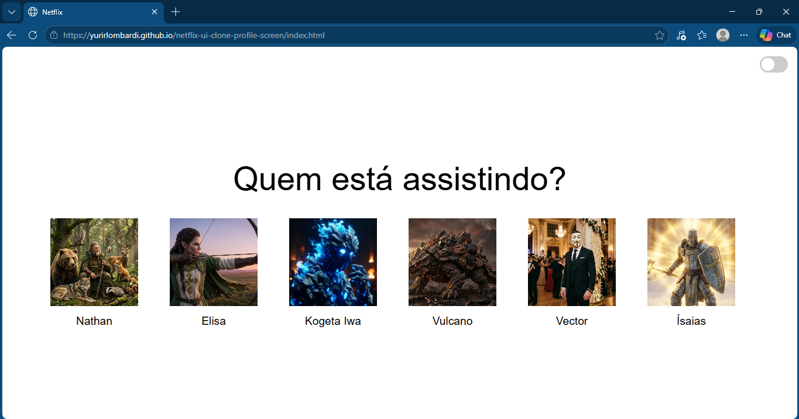
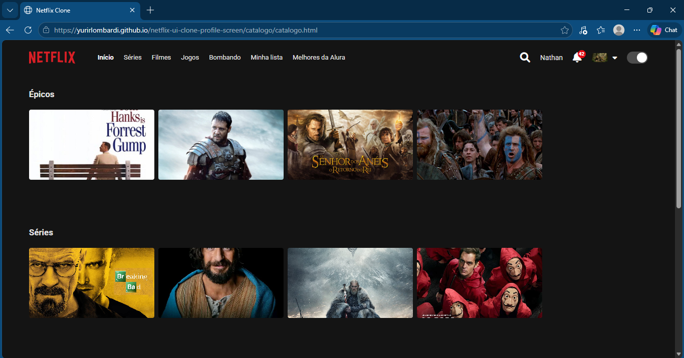
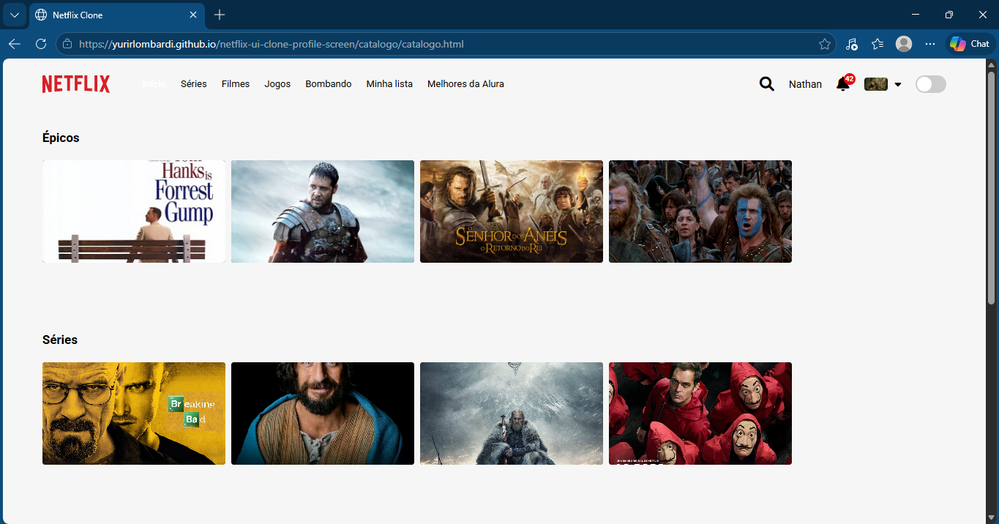

# 🎬 Netflix UI Clone

Projeto desenvolvido individualmente durante a Imersão Front-End com IA da Alura, com o objetivo de recriar a interface da Netflix, explorando conceitos modernos de desenvolvimento web e uso de inteligência artificial no auxílio à programação.

---

## 🚀 Demonstração

### 🎭 Seleção de Perfil

| Dark Mode | Light Mode |
|----------|-----------|
|  |  |

---

### 🎬 Catálogo de Conteúdo

| Dark Mode | Light Mode |
|----------|-----------|
|  |  |

---

## 🔗 Demo: https://yurirlombardi.github.io/netflix-ui-clone-profile-screen/
---

## 🎯 Objetivo

Reproduzir a interface de seleção de perfis da Netflix, focando na construção de layouts modernos, responsividade e boas práticas de front-end, com apoio de ferramentas de IA.

---

## 💡 Solução

O projeto consiste em um clone visual da tela de perfis da Netflix, permitindo:

- Exibição de perfis de usuário
- Interface interativa e responsiva
- Experiência visual semelhante à plataforma original

---

## ⚙️ Funcionalidades

- Interface de seleção de perfis
- Layout responsivo
- Interações com JavaScript
- Estruturação semântica do HTML
- Estilização com CSS moderno

---

## 🛠️ Tecnologias Utilizadas

- HTML
- CSS
- JavaScript
- GitHub Copilot (IA como apoio no desenvolvimento)

---

## 🧠 Conceitos Aplicados

- Responsividade (Mobile First)
- Manipulação de DOM
- Organização de layout
- Boas práticas de front-end

---

## 📂 Estrutura do Projeto 
/assets<br>
/css<br>
/js<br>
index.html 


---

## 🚀 Como Executar

```bash
git clone <repo>
cd netflix-ui-clone
```
Abra o arquivo index.html no navegador.

## 👨‍💻 Autor

Yuri Rodrigues Lombardi

🔗 LinkedIn: https://linkedin.com/in/yuri-rodrigues-lombardi

💻 GitHub: https://github.com/yuriRLombardi

